# OpsNexus - SRE Swiss Army Knife

OpsNexus is a high-performance utility application designed for Site Reliability Engineers (SREs). It consolidates common operational tools into a single, sleek desktop interface, optimized for speed and productivity.

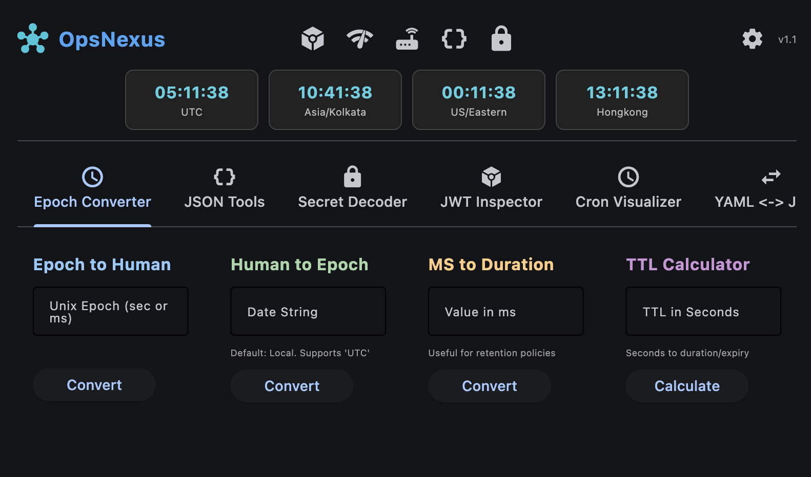

## ✨ Features

OpsNexus is built around a modular tab system, allowing you to enable only the tools you need.

### 🕒 Time Management & Epoch Converter

**Tab: Epoch Converter**

- **Bidirectional Conversion**: Seamlessly convert between Unix Epoch (seconds/milliseconds) and human-readable formats.
- **Automatic Detection**: Intelligently handles both 10-digit (seconds) and 13-digit (milliseconds) timestamps.
- **MS to Duration**: Convert raw milliseconds into human-friendly durations (e.g., "3 days, 4 hours").
- **TTL Calculator**: Enter a TTL in seconds to see the broken-down duration (Years/Months/Days) and the exact expiration date-time.

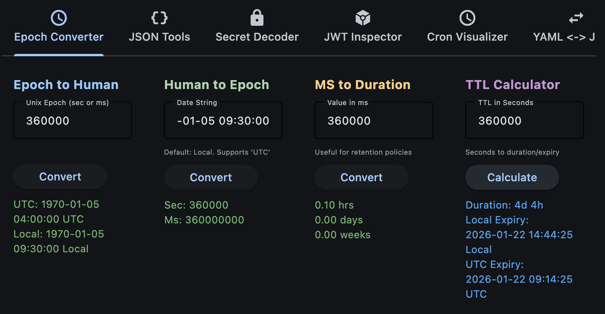

- **Global Timezone Bar**: Customizable real-time clocks for your most important global regions.


### 🛠️ Developer & Configuration Tools

#### JSON Tools

- **Formatter**: Beautify messy JSON logs or minify large payloads for API requests.
- **Validation**: Instant feedback on syntax errors.

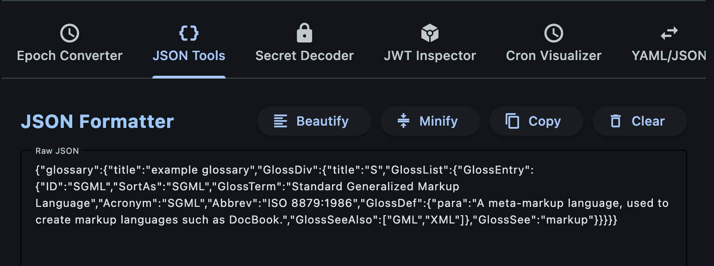

#### YAML <-> JSON

- One-click conversion between YAML and JSON, perfect for Kubernetes manifests and cloud-native configurations.


#### Secret Decoder

- Clean interface for Base64 encoding and decoding. Essential for handling Kubernetes secrets and configuration tokens.

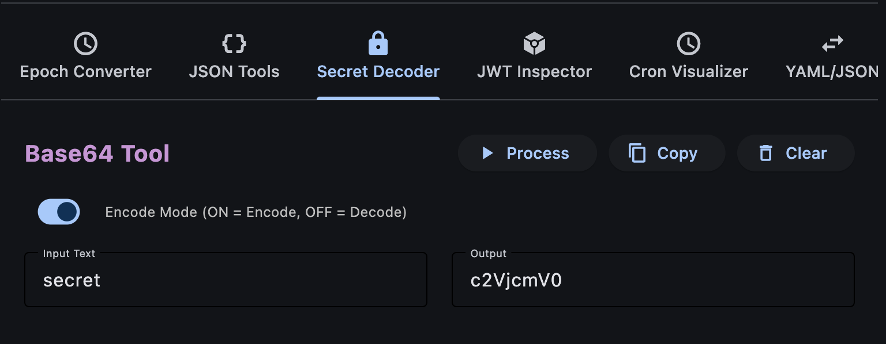

#### JWT Inspector

- Secure, offline inspection of JWT tokens. Instantly view header and payload data without sending sensitive tokens to a web service.

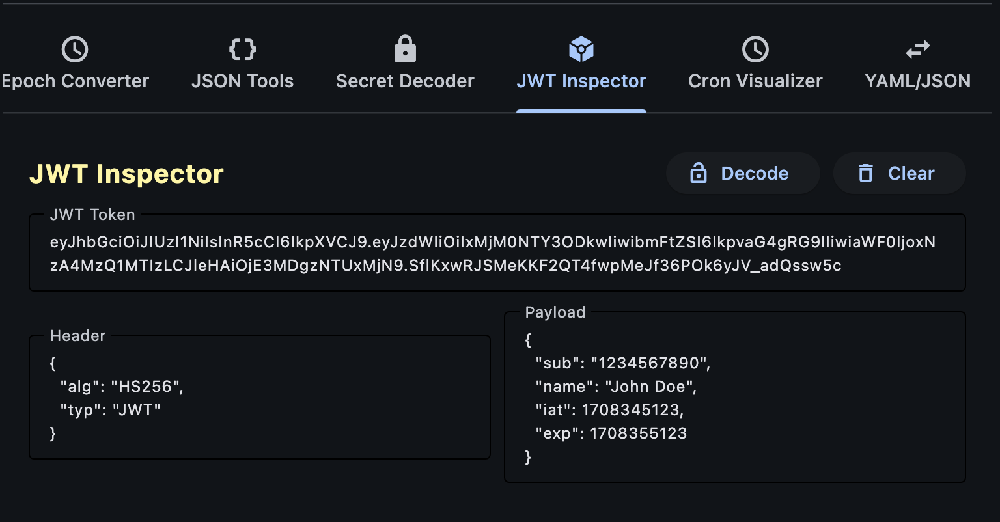

### 🚀 Production Troubleshooting

#### Regex Tester (SRE Focused)

- **Built-in Library**: Exhaustive patterns for Kafka logs, Nginx access, JVM stack traces, AWS ARNs, and more.
- **Custom Samples**: Save your own frequent patterns to a local persistent library.
- **File Loading**: Load large logs directly from a local path for testing.

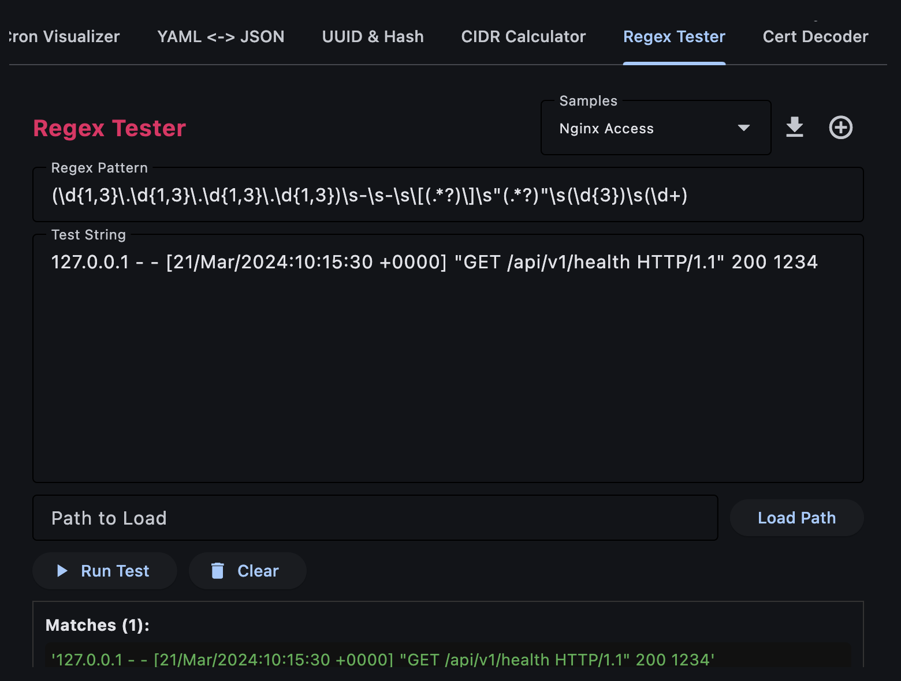

#### Cron Visualizer

- **Explainer**: Translates cryptic cron expressions into human-readable schedules with the next 5 execution times.
- **Builder**: Interactive builder to create valid cron strings without external documentation.

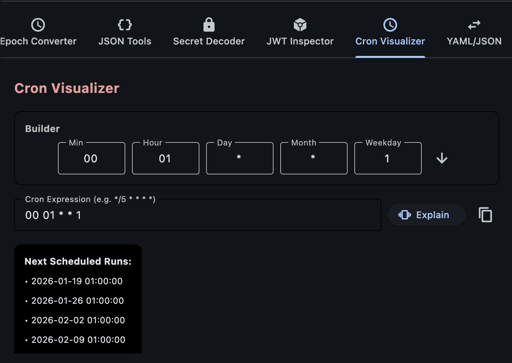

#### Advanced IP Subnet Calculator

- **Exhaustive Metadata**: Comprehensive breakdown including Binary/Hex IDs, IP Class, IP Type, Reverse DNS, and 6to4 prefixes.
- **IP Ownership Lookup**: Live identification of ISP, Organization, and Geographic Location for public IP addresses.
- **Subnet Explorer**: Visualise all possible sibling subnets within parent blocks (supports /8, /16, and /24 sizes).
- **Pro Mask Notation**: Dropdown selection with full dotted-decimal notation (e.g., `255.255.255.252 /30`).
- **P2P Support**: Accurate calculation for `/31` and `/32` networks.

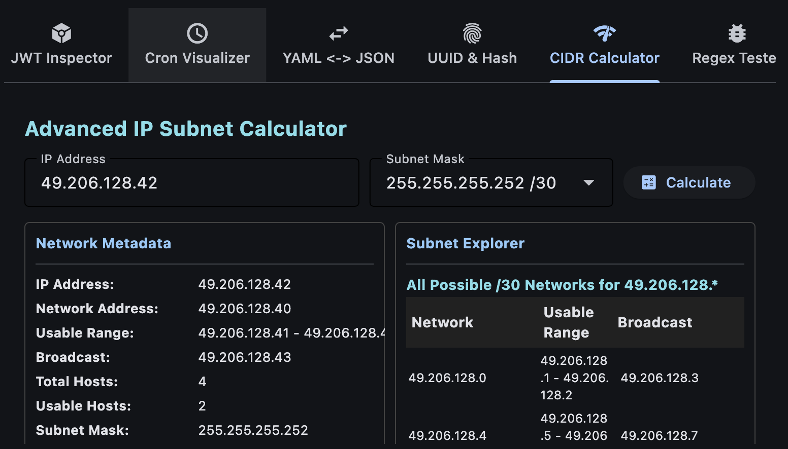

#### Certificate Decoder

- Inspect PEM-encoded certificates locally. View subject, issuer, validity dates, and serial numbers instantly.

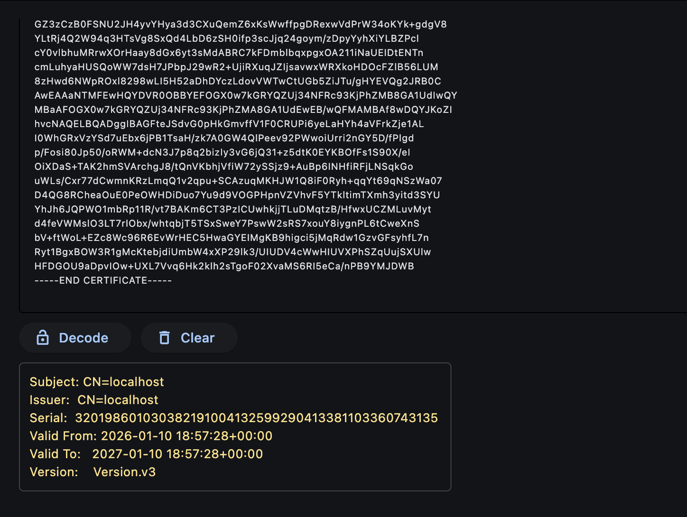

#### UUID & Hash Generator

- Generate UUIDs (v4) and create common hashes (MD5, SHA-1, SHA-256) for data verification and mock data creation.

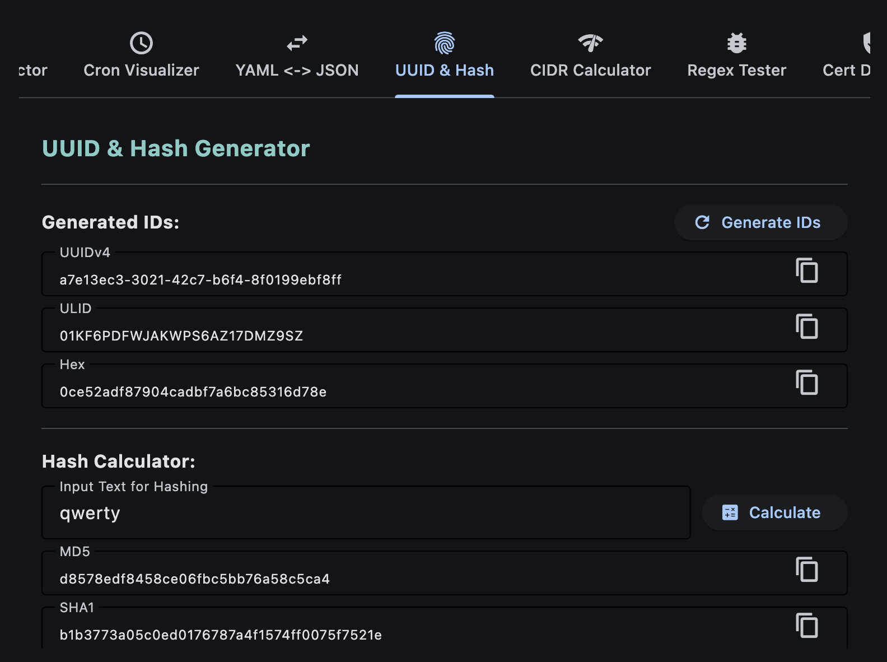

### 🌐 Network Operations Hub

**Tab: Network Tools**

- **TCP Port Checker**: Verify reachability for remote services (e.g., check if a Cisco switch management port or SD-WAN controller is up).
- **Wildcard Mask Helper**: Convert CIDR or Subnet masks to Cisco-style Wildcard masks (ideal for ACL configurations).
- **MTU/MSS Calculator**: Calculate the optimal TCP MSS for various tunnel types (IPsec, GRE, VXLAN, Wireguard) based on MTU and protocol overhead.
- **MAC Address Lookup**: Identify device manufacturers (vendors) from MAC addresses or OUIs using an integrated lookup tool.


- **MAC Address Lookup**: Identify device manufacturers (vendors) from MAC addresses or OUIs using an integrated lookup tool.

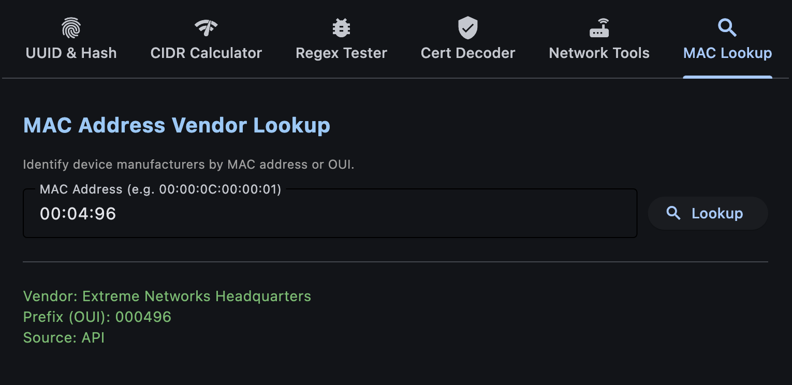

## ⚙️ Customization & Productivity

- **Tab Management**: Disable unused tabs via the Settings menu for a cleaner workspace.
- **Global Hotkey**: Toggle OpsNexus instantly from anywhere using `Option + H` (macOS) or `Alt + H` (Windows/Linux).
- **Quick Dismiss**: Press the `Escape` key at any time to instantly hide/minimize the app.
- **Smart Quick Access Bar**: A dynamic row of icon shortcuts in the header.
  - **Intelligence**: Automatically surfaces your 5 most-used tools with strict deduplication.
  - **Manual Pinning**: Pin frequently used tools (e.g., Network Tools) via Settings to keep them always visible.
  - **Absolute Centering**: Symmetric three-column layout ensures the bar is always in the mathematical center of the header.
- **Persistent Settings**: All configurations, including custom regex samples, pins, and active tabs, are saved to `~/.opsnexus/config.json`.

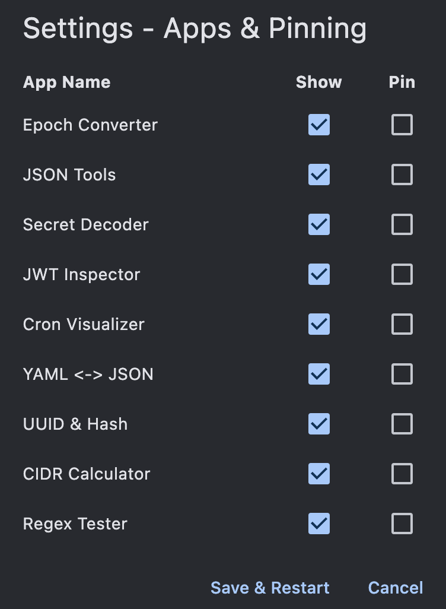

## 🚀 Quick Start

For detailed setup instructions, including macOS-specific permission steps, please refer to [INSTALL.md](INSTALL.md).

```bash
# Install dependencies
pip install -r requirements.txt

# Run the app
python3 main.py
```
